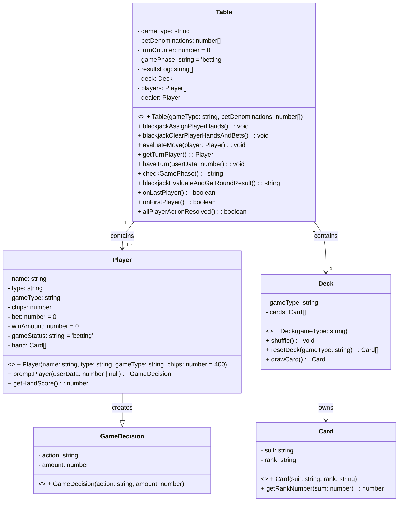
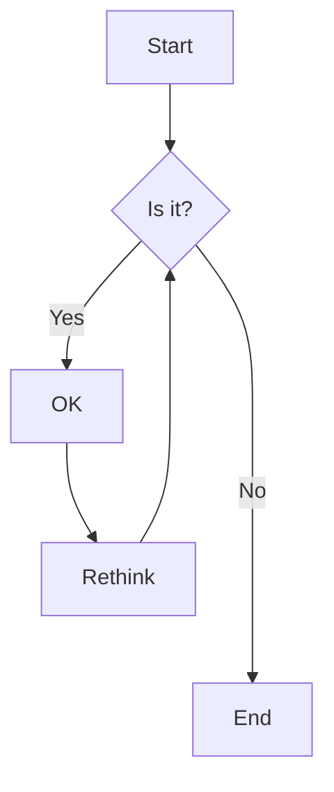

# クラス図

```mermaid

classDiagram

class Table {
  - gameType: string
  - betDenominations: number[]
  - turnCounter: number = 0
  - gamePhase: string = 'betting'
  - resultsLog: string[]
  - deck: Deck
  - players: Player[]
  - dealer: Player
  <<constructor>> + Table(gameType: string, betDenominations: number[])
  + blackjackAssignPlayerHands(): void
  + blackjackClearPlayerHandsAndBets(): void
  + evaluateMove(player: Player): void
  + getTurnPlayer(): Player
  + haveTurn(userData: number): void
  + checkGamePhase(): string
  + blackjackEvaluateAndGetRoundResult(): string
  + onLastPlayer(): boolean
  + onFirstPlayer(): boolean
  + allPlayerActionResolved(): boolean
}

class GameDecision {
  - action: string
  - amount: number
  <<constructor>> + GameDecision(action: string, amount: number)
}

class Player {
  - name: string
  - type: string
  - gameType: string
  - chips: number
  - bet: number = 0
  - winAmount: number = 0
  - gameStatus: string = 'betting'
  - hand: Card[]
  <<constructor>> + Player(name: string, type: string, gameType: string, chips: number = 400)
  + promptPlayer(userData: number | null): GameDecision
  + getHandScore(): number
}

class Deck {
  - gameType: string
  - cards: Card[]
  <<constructor>> + Deck(gameType: string)
  + shuffle(): void
  + resetDeck(gameType: string): Card[]
  + drawCard(): Card
}

class Card {
  - suit: string
  - rank: string
  <<constructor>> + Card(suit: string, rank: string)
  + getRankNumber(sum: number): number
}

Table "1" --> "1..*" Player : contains
Table "1" --> "1" Deck : contains
Player --|> GameDecision : creates
Deck --> Card : owns

```

# アクティビティ図

```mermaid

flowchart TD
    A[Start] --> B{Is it?}
    B -->|Yes| C[OK]
    C --> D[Rethink]
    D --> B
    B ---->|No| E[End]

```

# ワイヤーフレーム

@[figma](https://www.figma.com/file/EPLaTXzbelsQwzloanPgiT/%E7%84%A1%E9%A1%8C?type=design&node-id=0%3A1&mode=design&t=pPUzTf4AVHDKPvKo-1)
