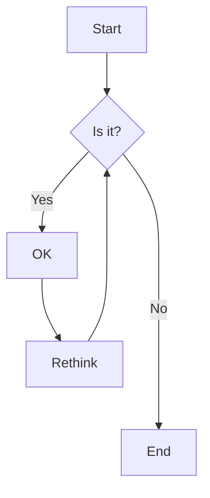

# クラス図

```mermaid

graph TD;
    class Duck{
        +String beakColor
        +swim()
        +quack()
    }
    class Fish{
        -int sizeInFeet
        -canEat()
    }
    class Zebra{
        +bool is_wild
        +run()
    }

```

# アクティビティ図



# ワイヤーフレーム

@[figma](https://www.figma.com/file/EPLaTXzbelsQwzloanPgiT/%E7%84%A1%E9%A1%8C?type=design&node-id=0%3A1&mode=design&t=pPUzTf4AVHDKPvKo-1)
